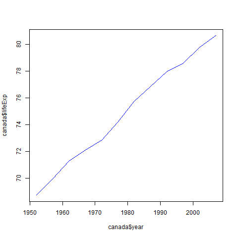

```{r setup, include=FALSE}
knitr::opts_chunk$set(echo = TRUE)
any language we can use for markdown
```

## R Markdown

This is an R Markdown document. Markdown is a simple formatting syntax for authoring HTML, PDF, and MS Word documents. For more details on using R Markdown see <http://rmarkdown.rstudio.com>.

When you click the **Knit** button a document will be generated that includes both content as well as the output of any embedded R code chunks within the document. You can embed an R code chunk like this:


## Including Plots

You can also embed plots, for example:
  
  ```{r pressure, echo=FALSE}
plot(pressure)
```

Note that the `echo = FALSE` parameter was added to the code chunk to prevent printing of the R code that generated the plot.

# Title  
## Main Section  
### Sub Section  
#### Sub-sub Section

**bold**  
_Italics_  
'r' 

[](https://www.google.com)  
<https://www.google.com>  

  <!-- no space after ]() --> 

$E=mc^2$   


```{r load_data ,echo=FALSE,results='hide'}  
library(ggplot2)
gapminder<-read.table("Data/gapminder.txt",header=TRUE)


gapminder <- read.table(file="Data/gapminder.txt",header = TRUE)
canada<-gapminder[gapminder$country=="Canada",]
my_plot<-ggplot(data=canada,aes(x=year,y=lifeExp))+geom_line()
my_plot
```

``` {r working og _knitr,echo=FALSE,results='hide'}  
## options {r working og _knitr,echo=FALSE,results='hide',eval=FALSE,warning=FALSE}  
### Run this code in R to see graphic of how
### your document gets rendered

par(mar=rep(0, 4), bty="n", cex=1.5)
plot(0, 0, type="n", xlab="", ylab="", xaxt="n", yaxt="n",
     xlim=c(0, 100), ylim=c(0, 100))
xw <- 10
yh <- 35
xm <- 12
ym <- 50
rect(xm-xw/2, ym-yh/2, xm+xw/2, ym+yh/2, lwd=2)
text(xm, ym, ".Rmd")

xm <- 50
ym <- 80
rect(xm-xw/2, ym-yh/2, xm+xw/2, ym+yh/2, lwd=2)
text(xm, ym, ".md")
xm <- 50; ym <- 25
for(i in c(2, 0, -2))
    rect(xm-xw/2+i, ym-yh/2+i, xm+xw/2+i, ym+yh/2+i, lwd=2,
         border="black", col="white")
text(xm-2, ym-2, "figs/")

xm <- 100-12
ym <- 50
rect(xm-xw/2, ym-yh/2, xm+xw/2, ym+yh/2, lwd=2)
text(xm, ym, ".html")

arrows(22, 50, 38, 50, lwd=2, col="slateblue", len=0.1)
text((22+38)/2, 60, "knitr", col="darkslateblue", cex=1.3)

arrows(62, 50, 78, 50, lwd=2, col="slateblue", len=0.1)
text((62+78)/2, 60, "pandoc", col="darkslateblue", cex=1.3)
```

The average of the class is 44.0273774. `r round(44.0273774,2)`